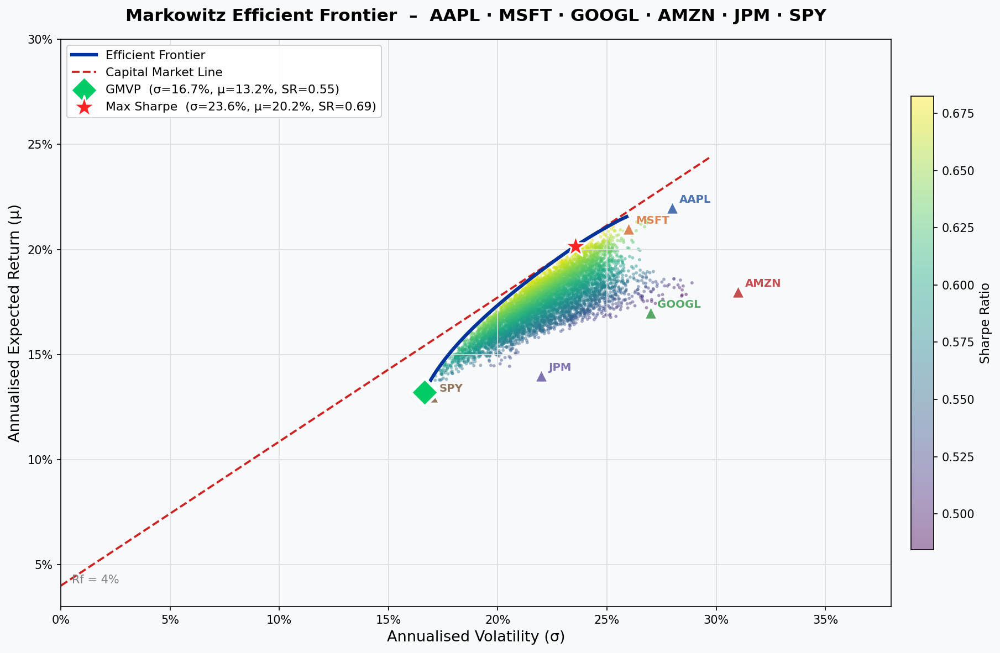
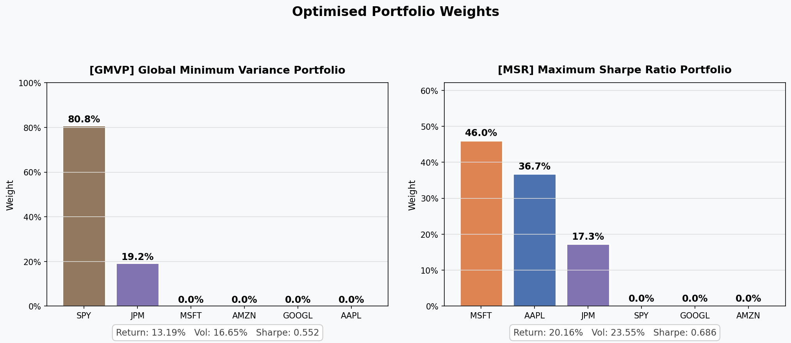
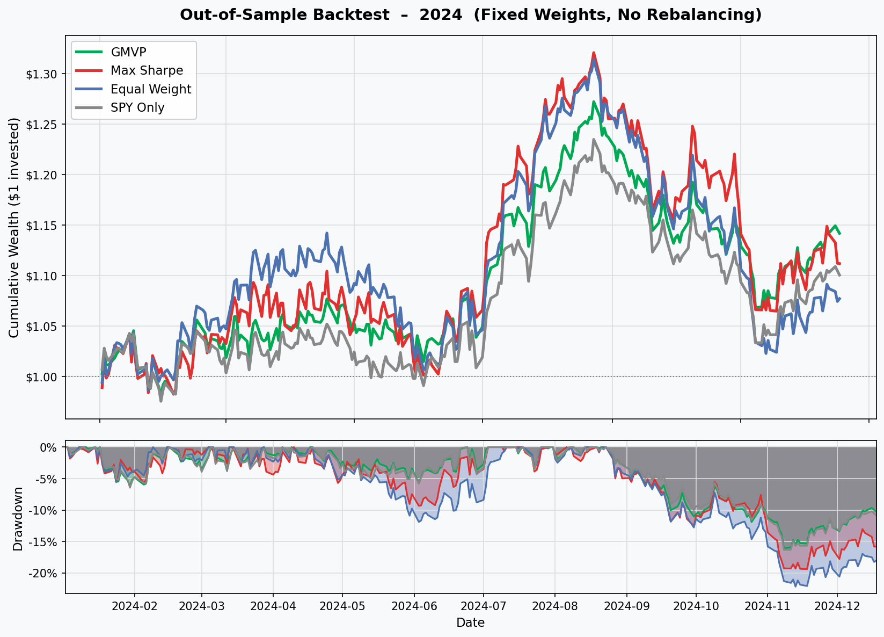
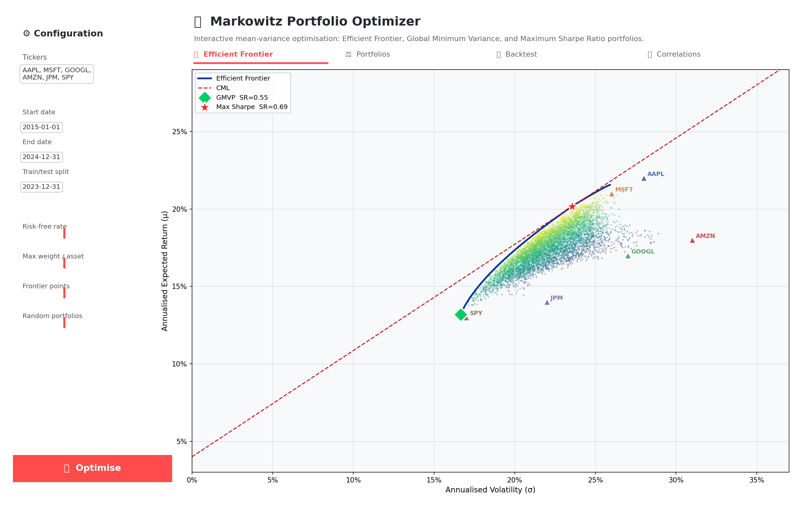

# Markowitz Portfolio Optimizer

An interactive quantitative-finance application implementing Markowitz mean-variance optimization, efficient-frontier construction, portfolio diagnostics, and historical backtesting.

## What It Demonstrates

- Clean separation between data, optimization, metrics, and visualization
- Constrained portfolio optimization with CVXPY
- Global Minimum Variance and Maximum Sharpe portfolios
- Efficient-frontier simulation and visualization
- Diversification, correlation, and allocation diagnostics
- Historical comparison against an equal-weight benchmark
- Interactive controls through Streamlit

## Application Preview

### Efficient Frontier

### Portfolio Weights

### Historical Backtest

### Interactive Application

## Optimization Model

For asset weights **w**, expected returns **μ**, and covariance matrix **Σ**, the optimizer minimizes portfolio variance subject to configurable constraints:

~~~text
minimize    wᵀΣw
subject to  Σw = 1
            w ≥ 0
            μᵀw ≥ target return
            w ≤ maximum allocation
~~~

This produces portfolios on the efficient frontier and supports comparison of the minimum-variance and maximum-risk-adjusted-return solutions.

## Run Locally

~~~bash
git clone https://github.com/ParBproject/Portfolio-Optimizer.git
cd Portfolio-Optimizer

python -m venv .venv
source .venv/bin/activate
pip install -r requirements.txt
streamlit run app.py
~~~

Open http://localhost:8501.

## Repository Structure

~~~text
Portfolio-Optimizer/
├── app.py
├── src/
│   ├── data_handler.py
│   ├── metrics.py
│   ├── optimizer.py
│   └── visualization.py
├── notebooks/
├── screenshots/
└── requirements.txt
~~~

## Skills Demonstrated

Convex optimization, portfolio theory, Python, pandas, NumPy, CVXPY, Plotly, Streamlit, historical data handling, backtesting, and modular application design.

## Assumptions & Limitations

Expected returns and covariance are estimated from historical observations and may be unstable. The long-only model excludes taxes and market impact; backtests are sensitive to the selected period and assets. This project is educational and does not constitute financial advice.
