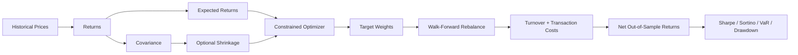

# Quantitative Portfolio Research Lab

[](requirements.txt)
[](src/optimizer.py)
[](src/backtest.py)
[](app.py)
[](https://github.com/ParBproject/Portfolio-Optimizer/actions/workflows/ci.yml)

A portfolio-grade quantitative research project for **portfolio construction, risk analysis, out-of-sample validation, and implementation-aware backtesting** using historical financial data.

This repository goes beyond a standard Markowitz demo. It combines constrained optimization, covariance regularization, no-lookahead walk-forward testing, turnover-aware transaction costs, downside/tail-risk metrics, and an interactive research dashboard.

## Employer snapshot

| Capability | Evidence |
|---|---|
| Real market data | Historical adjusted prices via Yahoo Finance |
| Optimization | CVXPY minimum-variance and maximum-Sharpe portfolios |
| Portfolio theory | Efficient frontier, covariance-aware risk, allocation constraints |
| Robust estimation | Configurable covariance shrinkage toward a diagonal target |
| Validation | Static holdout plus rolling no-lookahead walk-forward research |
| Implementation realism | Rebalancing, one-way turnover, transaction costs |
| Risk analytics | Volatility, Sharpe, Sortino, drawdown, Calmar, VaR, Expected Shortfall |
| Benchmarking | Equal-weight comparison and cumulative-wealth analysis |
| Engineering | Modular Python, automated tests, CI on Python 3.10 and 3.12 |
| Communication | Professional Streamlit research interface and interactive Plotly charts |

## Research workflow

### Research architecture




```text
Historical adjusted prices
        ↓
Cleaning and return transformation
        ↓
Rolling estimation window
        ↓
Expected returns + covariance
        ↓
Optional covariance shrinkage
        ↓
Constrained optimization
        ↓
Target portfolio weights
        ↓
Hold until next rebalance
        ↓
Turnover + transaction costs
        ↓
Net out-of-sample returns
        ↓
Risk-adjusted metrics + benchmark comparison
```

The walk-forward path uses only data available **before each rebalance date**. Future observations never enter the estimation window.

## Why this is more than a basic Markowitz project

A common portfolio project estimates one covariance matrix, optimizes once, and reports in-sample results. This repository adds several layers that are more representative of real quantitative research:

- rolling no-lookahead re-estimation;
- transaction-cost-aware portfolio implementation;
- explicit turnover measurement;
- configurable concentration constraints;
- covariance shrinkage for estimator stability;
- separate static holdout and walk-forward views;
- downside and tail-risk metrics;
- automated numerical regression tests.

## Interactive research dashboard

Run:

```bash
git clone https://github.com/ParBproject/Portfolio-Optimizer.git
cd Portfolio-Optimizer

python -m venv .venv
source .venv/bin/activate
python -m pip install -r requirements.txt

streamlit run app.py
```

The redesigned dashboard is organized around five research views:

**Efficient Frontier** — opportunity set, capital-market line, minimum-variance and maximum-Sharpe portfolios.

**Portfolio Allocations** — optimized weights, concentration visibility, and side-by-side portfolio structure.

**Walk-Forward Research** — rolling no-lookahead optimization, transaction-cost assumptions, turnover, wealth curves, drawdowns, tail risk, and allocation paths.

**Dependence Structure** — correlation and covariance diagnostics.

**Methodology** — optimization assumptions, robust-estimation choices, validation design, and implementation limitations.

## Efficient frontier


For weights **w**, expected returns **μ**, and covariance matrix **Σ**, the long-only optimizer solves:

```text
minimize    wᵀΣw

subject to  1ᵀw = 1
            w ≥ 0
            w ≤ maximum allocation
            μᵀw ≥ target return     (frontier points)
```

The project separately solves the global minimum-variance and maximum-Sharpe portfolios.

## Robust covariance estimation

Historical sample covariance can be noisy, particularly with short windows or correlated assets.

The project provides a transparent shrinkage option:

```text
Σ_shrunk = (1 - λ) Σ_sample + λ diag(Σ_sample)
```

where **λ ∈ [0,1]** controls the shrinkage intensity.

This preserves each asset's sample variance while reducing reliance on unstable off-diagonal covariance estimates.

## Walk-forward backtesting

The core research upgrade is implemented in `src/backtest.py`.

At every rebalance:

1. Take only the preceding lookback window.
2. Estimate expected returns and covariance.
3. Apply the selected optimization strategy.
4. Hold the resulting weights until the next rebalance.
5. Measure portfolio drift and one-way turnover.
6. Apply transaction costs in basis points.
7. Record net wealth and realized allocations.

This design avoids using future observations in portfolio construction.

## Risk and performance analytics

The evaluation layer reports:

- annualized return;
- annualized volatility;
- Sharpe ratio;
- Sortino ratio;
- maximum drawdown;
- Calmar ratio;
- 95% historical Value at Risk;
- 95% historical Expected Shortfall;
- cumulative wealth;
- turnover;
- modeled implementation cost.

## Portfolio allocation


The dashboard displays optimized allocations alongside expected return, volatility, and risk-adjusted performance so the result is interpretable as a portfolio decision rather than only an optimization output.

## Historical performance


Historical performance is treated as validation evidence—not as a prediction of future returns.

## Repository structure

```text
Portfolio-Optimizer/
├── app.py
├── data/
│   └── fetch_data.py
├── src/
│   ├── backtest.py
│   ├── data_handler.py
│   ├── metrics.py
│   ├── optimizer.py
│   └── visualization.py
├── tests/
│   ├── test_backtest.py
│   └── test_optimizer_metrics.py
├── notebooks/
├── screenshots/
├── .streamlit/
│   └── config.toml
├── .github/workflows/
│   └── ci.yml
├── requirements.txt
└── requirements-dev.txt
```

## Quality and reproducibility

The automated test suite checks behavior including:

- portfolio weights remain fully invested;
- transaction costs reduce terminal wealth when turnover is non-zero;
- walk-forward research starts only after the estimation lookback;
- covariance shrinkage preserves individual variances;
- shrinkage reduces off-diagonal covariance;
- the selected risk-free rate propagates into reported Sharpe ratios;
- Expected Shortfall is at least as severe as historical VaR;
- downside-risk metrics remain numerically well behaved.

GitHub Actions runs linting, unit tests, compilation, and import checks on Python **3.10 and 3.12**.

## Skills demonstrated

**Quantitative finance:** Markowitz optimization, efficient frontiers, covariance estimation, portfolio constraints, walk-forward research, turnover, transaction costs, VaR, Expected Shortfall.

**Data analysis:** pandas, NumPy, historical market-data transformation, train/test design, correlation analysis, KPI comparison, interactive reporting.

**Numerical computing:** CVXPY, SciPy, matrix operations, constrained optimization, reproducibility.

**Software engineering:** modular Python, regression tests, CI/CD, validation, explicit assumptions, dependency separation.

## Assumptions and limitations

- Expected returns and covariance are historical estimates and are regime-dependent.
- The backtest models proportional transaction costs but not market impact, taxes, borrow costs, latency, or every institutional constraint.
- Long-only optimization is used; shorting and leverage are not modeled in the core workflow.
- Yahoo Finance data may be revised, delayed, or unavailable.
- Historical and simulated performance does not guarantee future performance.

## Roadmap

- Ledoit-Wolf and alternative covariance estimators
- risk-parity and maximum-diversification portfolios
- Black-Litterman expected-return integration
- rolling factor-exposure diagnostics
- downloadable research reports

## Disclaimer

Educational quantitative-finance project only. Nothing in this repository is investment advice.
