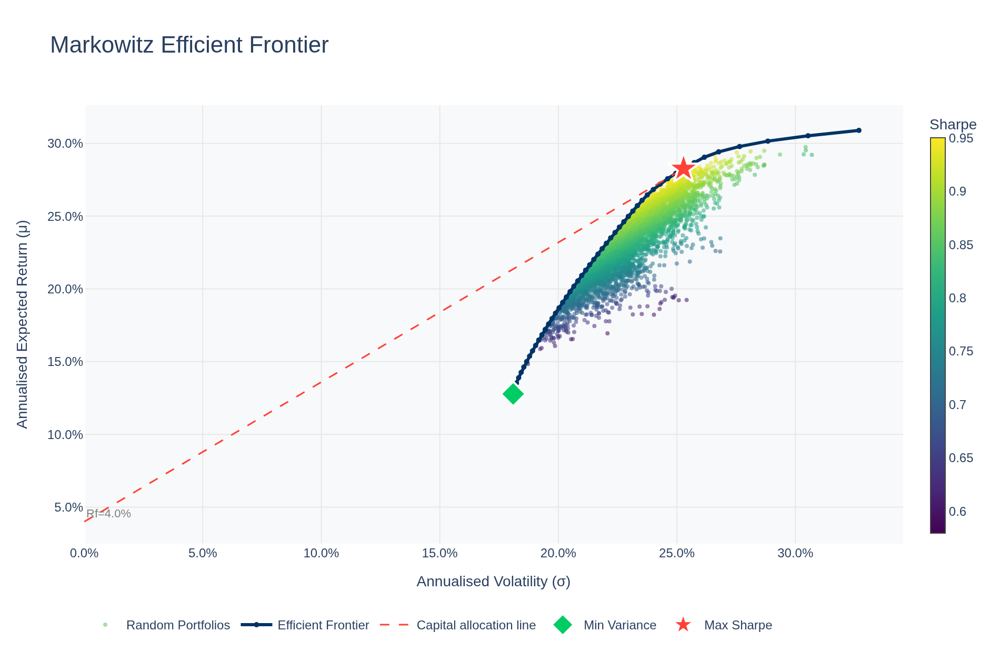
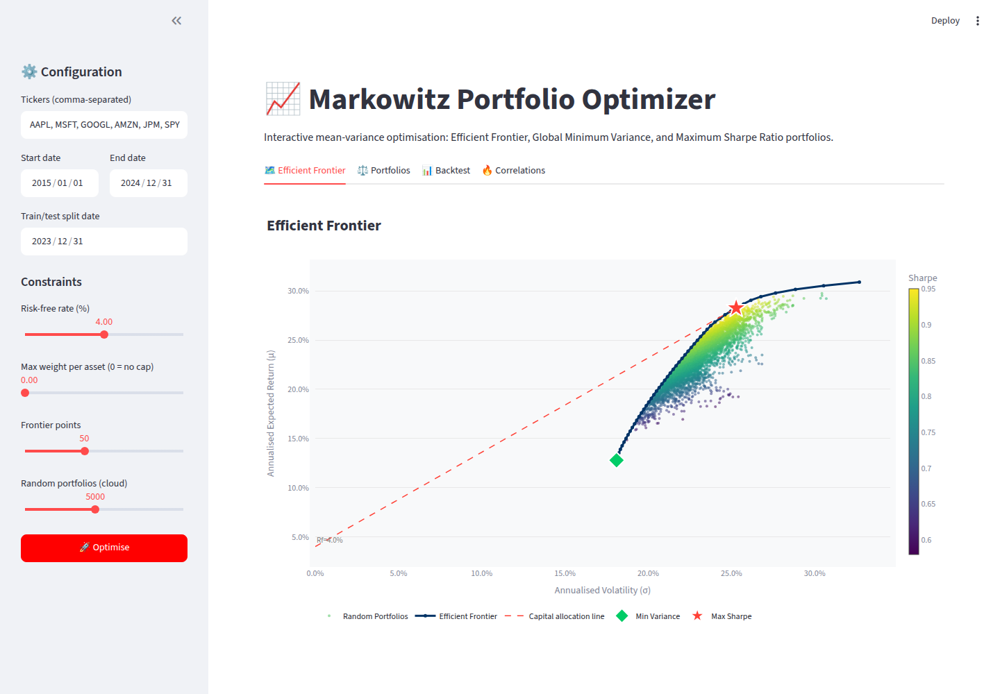
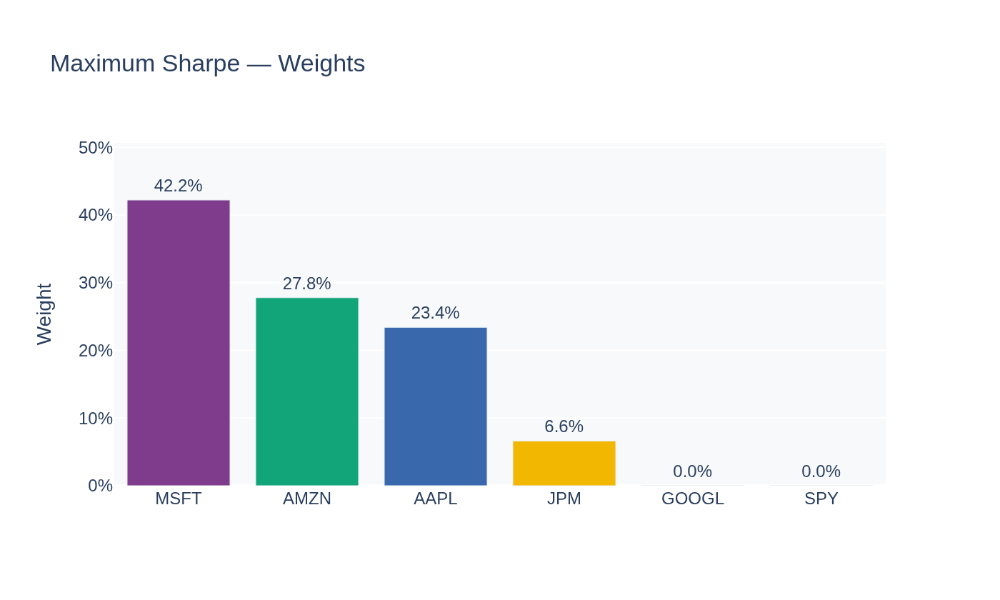
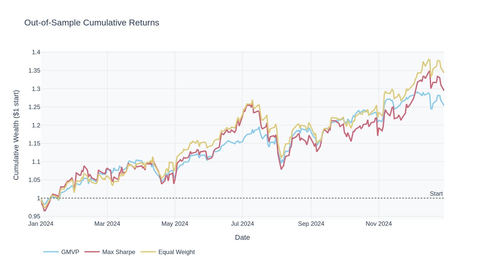

# Markowitz Portfolio Optimizer

**[Live demo](https://parbproject.github.io/Portfolio-Optimizer/)** — the Streamlit app running in your browser. No sign-in and no server. Prices are a static Yahoo Finance snapshot, and the page states that date range. `streamlit run app.py` still downloads live prices.

## For a data analyst application

**Supporting finance piece.** Mean-variance optimization with an equal-weight benchmark. Show the frontier and the weight chart if the role is portfolio analytics. It is not the operations or SQL case study.

An interactive quantitative-finance application implementing Markowitz mean-variance optimization, efficient-frontier construction, portfolio diagnostics, and a single train/test backtest.

The chart images were written by `python scripts/render_figures.py` from split- and dividend-adjusted Yahoo Finance closes for AAPL, MSFT, GOOGL, AMZN, JPM, and SPY, requested from 2015-01-01 through 2024-12-31, with the training window ending 2023-12-31 and a constant 4% risk-free rate. They show the tools on that window. They are not a live track record, and the README does not claim that either optimised portfolio beat the equal-weight benchmark.

## What It Demonstrates

- Clean separation between data, optimization, metrics, and visualization
- Constrained long-only portfolio optimization with CVXPY (SciPy SLSQP is a second solver)
- Global minimum-variance and maximum Sharpe portfolios
- Efficient-frontier construction and a random long-only cloud
- Correlation and allocation charts
- An equal-weight comparison on the held-out window
- Interactive controls through Streamlit
- Unit tests for the return math, the weight constraints, and the train/test split

## Application Preview

### Efficient Frontier

The dashed segment is the capital allocation line from cash to the maximum-Sharpe portfolio. It stops there. The optimiser does not borrow.

### Portfolio Weights

### Historical Backtest

Wealth assumes daily rebalancing to the fixed in-sample weights. There are no transaction costs.

### Interactive Application

## Optimization Model

For weights **w**, annualised expected simple returns **μ**, and an annualised covariance **Σ**:

~~~text
minimize    wᵀ Σ w
subject to  1ᵀ w = 1
            w ≥ 0
            μᵀ w ≥ target return     (omitted for the global minimum-variance portfolio)
            w ≤ w_max                (omitted when no cap is set)
~~~

**μ** and **Σ** are the in-sample sample mean and sample covariance (divisor n − 1) of daily simple returns, each multiplied by 252. That annualisation assumes returns are uncorrelated across days.

The maximum-Sharpe portfolio is a different convex program. With excess return π = μ − r_f · 1 it minimises yᵀ Σ y subject to πᵀ y = 1 and y ≥ 0, then sets w = y / 1ᵀ y. The same optional cap applies. If the cap cannot sum to one, no asset has a positive excess return, or the covariance is not positive semidefinite, the solver returns no weights instead of a repaired portfolio.

The Sharpe ratio attached to a portfolio is (wᵀ μ − r_f) / sqrt(wᵀ Σ w), using the same risk-free rate for the minimum-variance portfolio, the maximum-Sharpe portfolio, and the frontier.

## Run Locally

~~~bash
git clone https://github.com/ParBproject/Portfolio-Optimizer.git
cd Portfolio-Optimizer

python -m venv .venv
source .venv/bin/activate
pip install -r requirements.txt
streamlit run app.py
~~~

Open http://localhost:8501.

Tests and the linter (CI runs both):

~~~bash
pip install -r requirements-dev.txt
ruff check app.py src data tests scripts
pytest
~~~

Re-render the chart images (needs Yahoo Finance unless `data/cache` already exists, and needs Kaleido from `requirements-dev.txt`):

~~~bash
python scripts/render_figures.py
~~~

## Repository Structure

~~~text
Portfolio-Optimizer/
├── app.py
├── src/
│   ├── backtest.py
│   ├── data_handler.py
│   ├── metrics.py
│   ├── optimizer.py
│   └── visualization.py
├── data/
│   ├── fetch_data.py
│   └── snapshot/          # bundled prices for the browser demo
├── notebooks/
├── scripts/render_figures.py
├── scripts/build_demo.py  # static site for GitHub Pages
├── tests/
├── screenshots/
├── .github/workflows/ci.yml
├── .github/workflows/pages.yml
└── requirements.txt
~~~

## Skills Demonstrated

Convex optimization, portfolio theory, Python, pandas, NumPy, CVXPY, Plotly, Streamlit, a causal train/test split, and modular application design.

## Assumptions & Limitations

- Inputs are daily simple returns. A constant-weight backtest is the weighted sum of those returns, which is daily rebalancing, not buy-and-hold.
- Arithmetic annualised return is mean(r) × 252. CAGR is (Π(1+r))^(252/T) − 1 and is reported separately. Sharpe uses the arithmetic excess return over a constant annual risk-free rate. Calmar is CAGR / maximum drawdown and does not subtract the risk-free rate. Drawdown is measured on a wealth index that starts at 1.
- Volatility uses the sample standard deviation (divisor T − 1), so it matches the square root of the annualised sample variance.
- Prices are forward-filled for at most five sessions. Longer gaps are dropped rather than carried forward as a flat price.
- The reported μ and Σ use only returns on or before the split date. The test window is every later session. The default split date in the app is 2023-12-31; the first test return is the next session, including when that date is not itself a trading day.
- The [live demo](https://parbproject.github.io/Portfolio-Optimizer/) is this same app, packaged with [stlite](https://github.com/whitphx/stlite) so it runs in the browser. Browsers cannot call Yahoo Finance, so the demo reads `data/snapshot` and labels that snapshot's date range. A local run still uses live Yahoo Finance. The in-browser optimiser solves the same quadratic programmes with SciPy SLSQP, because CVXPY's compiled solvers are not available in Pyodide.
- The app does one split. The backtest notebook can refit the maximum-Sharpe portfolio at each out-of-sample month using only data from before that month.
- Long only, fully invested, optional per-name cap. No leverage, shorts, taxes, or market impact.
- Expected returns and covariances estimated this way are noisy. This project is educational and does not constitute financial advice.
